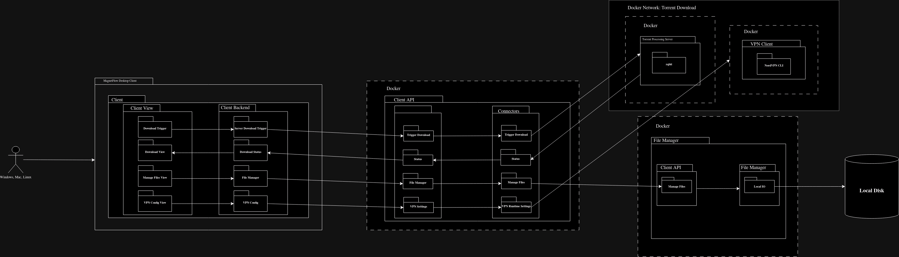

# MagnetFlow
## Streamline Your Downloads with MagnetFlow!

### Summary
Overview: MagnetFlow is a cross-platform torrenting infrastructure designed to streamline the downloading of torrent files via magnet links. Available on Windows, Mac, and Linux, the application aims to provide users with a seamless experience for managing their downloads while ensuring data privacy.

Core Features:

    Magnet Link Integration: Automatically handles magnet links from web browsers, allowing users to initiate downloads with a single click.
    Dual Interface:
        Download Progress Page: Displays real-time status updates on ongoing downloads, complete with progress bars and notifications.
        File Management Page: Enables users to organize their downloaded files—offering options to delete, move, or update directories with ease.

Backend Functionality:

    The application leverages rqbit, a torrent downloader, running on a secure server hosted in a Docker container. This architecture offloads the downloading process from the client machine to a dedicated server.
    To enhance user privacy, all download traffic is routed through Gluetun, masking the server's IP address and ensuring anonymity.

User Experience: MagnetFlow prioritizes a clean, intuitive interface that simplifies the torrenting process for both novice and experienced users. The combination of powerful backend processing and user-friendly design makes it a versatile tool for managing torrent downloads securely and efficiently.

Goals:

    To provide a fast, reliable, and privacy-focused solution for torrent downloading.
    To empower users with easy management of their downloaded files and an organized workflow.

MagnetFlow stands out as a comprehensive system for anyone looking to enhance their torrent downloading experience for their homelab/homeserver while maintaining privacy and control over their files with a few simple clicks!

### Important Notes
- PLEASE REVIEW THE LICENSE ATTACHED TO THIS REPO AS IT CONTAINS IMPORTANT INFORMATION THAT USERS SHOULD BE AWARE OF!!!

### High-Level System Structure
The system can be described as such below:

### Technologies

The technologies used in the MagnetFlow system can be described as such:

    Desktop Client:
        - Tauri -> https://v2.tauri.app/
        - tonic -> https://github.com/hyperium/tonic
    Client API:
        - Docker -> https://www.docker.com/
        - tonic -> https://github.com/hyperium/tonic
    Torrent Download Server:
        - Docker -> https://www.docker.com/
        - rqbit -> https://github.com/ikatson/rqbit 
    Docker Network (VPN): 
        - qmcgaw/gluetun -> https://hub.docker.com/r/qmcgaw/gluetun 
    Managing Docker Containers/Deployments
        - Kubernetes -> https://kubernetes.io/

### Additional Information
Details about each part of the application system can be found in their respective repositories listed below:
    - Desktop -> https://github.com/vexxuh/MagnetFlow-Desktop
    - Client-API -> https://github.com/vexxuh/MagnetFlow-ClientAPI
    - Torrent-Server -> https://github.com/vexxuh/MagnetFlow-TorrentServer
    - File-Manager -> https://github.com/vexxuh/MagnetFlow-FileManager
    - Deployment -> https://github.com/vexxuh/MagnetFlow-Deployer

Documentation for installation, setup, and configuration can be found in the wiki pages of this repo! Or you can use this link to navigate straight there -> https://github.com/vexxuh/MagnetFlow/wiki

If you have any questions or experience any problems while using the application please feel free to submit a request in the Issues section of the github here -> https://github.com/vexxuh/MagnetFlow/issues
